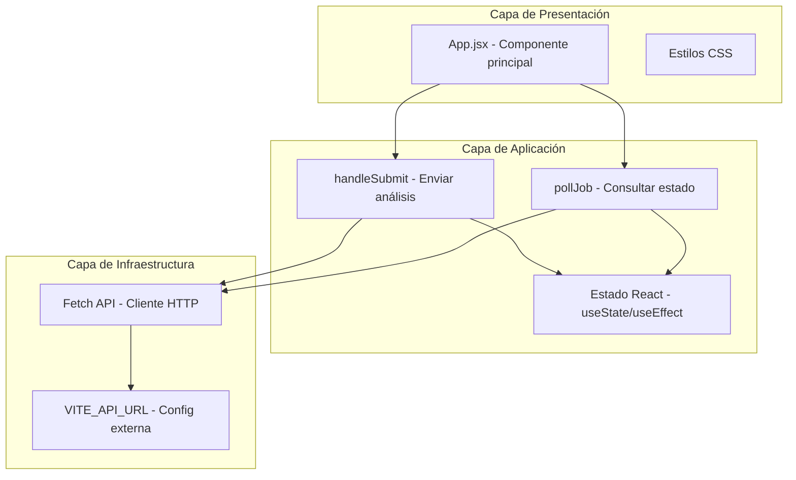

# Diagrama de Capas - Frontend (React)

## Arquitectura Limpia

## Responsabilidades por Capa

| Capa | Archivos | Responsabilidad |
|------|----------|-----------------|
| **Presentación** | `App.jsx`, `App.css`, `index.css` | UI, formulario, visualización de resultados |
| **Aplicación** | Lógica en `App.jsx` | Orquestar envío, polling, manejo de estado |
| **Infraestructura** | `fetch()`, variables de entorno | Comunicación REST con Python Service |

## Principios

- Sin estado persistente en el cliente (stateless)
- Configuración externa via `VITE_API_URL`
- Separación visual (CSS) de lógica (JSX)
- Polling desacoplado del renderizado
