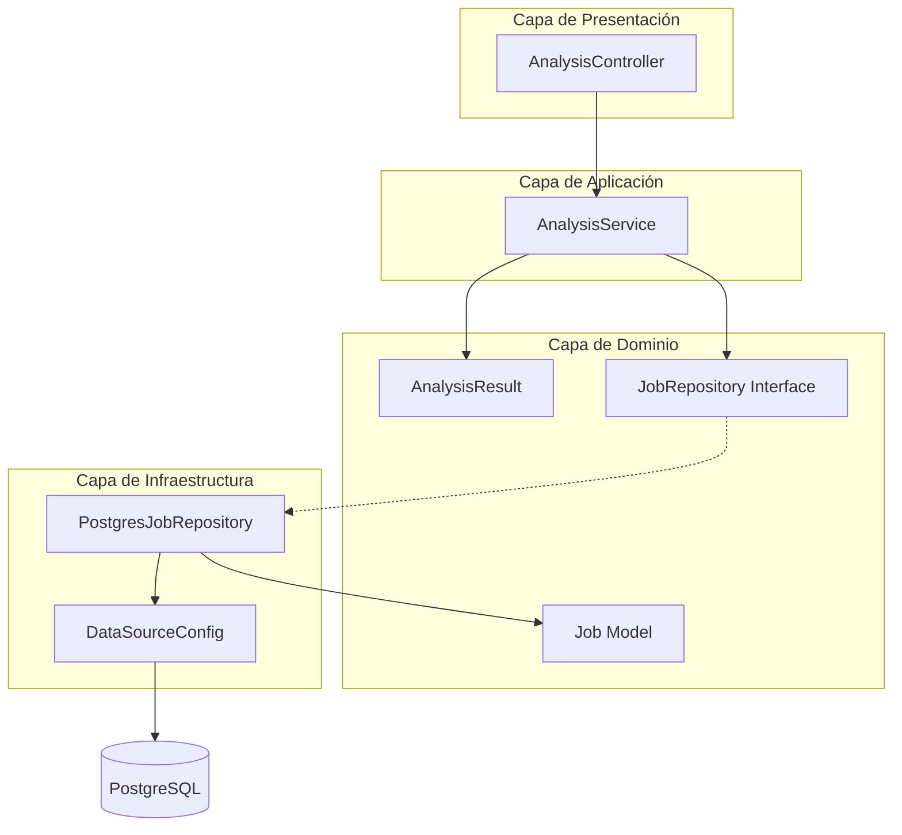

# Diagrama de Capas - Java Service (Análisis)

## Arquitectura Limpia



## Estructura de Paquetes

```
java-service/src/main/java/com/analyticore/
├── domain/
│   ├── model/Job.java, AnalysisResult.java
│   └── repository/JobRepository.java
├── application/
│   └── service/AnalysisService.java
├── infrastructure/
│   ├── persistence/PostgresJobRepository.java
│   └── config/DataSourceConfig.java, AppConfig.java
└── presentation/
    └── controller/AnalysisController.java
```

## Responsabilidades

| Capa | Responsabilidad |
|------|-----------------|
| **Dominio** | Modelos `Job`, `AnalysisResult`, interfaz repositorio |
| **Aplicación** | Lógica de análisis: sentimiento + keywords |
| **Infraestructura** | Persistencia PostgreSQL, configuración DataSource |
| **Presentación** | Endpoint REST `/api/analyze` |

## Algoritmo de Análisis

1. Normalizar texto (minúsculas, sin acentos)
2. **Sentimiento**: contar palabras positivas vs negativas → POSITIVO / NEGATIVO / NEUTRO
3. **Keywords**: frecuencia de palabras (excluyendo stopwords) → top 5
