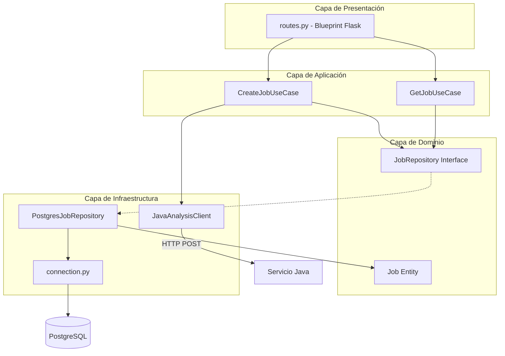

# Diagrama de Capas - Python Service (Submisión)

## Arquitectura Limpia



## Estructura de Carpetas

```
python-service/app/
├── domain/
│   ├── entities/job.py          # Entidad de dominio
│   └── repositories/job_repository.py  # Interfaz
├── application/
│   └── use_cases/
│       ├── create_job_use_case.py
│       └── get_job_use_case.py
├── infrastructure/
│   ├── database/
│   │   ├── connection.py
│   │   └── postgres_job_repository.py
│   └── http/java_analysis_client.py
├── presentation/
│   └── api/routes.py
└── main.py
```

## Responsabilidades

| Capa | Responsabilidad |
|------|-----------------|
| **Dominio** | Entidad `Job`, contrato `JobRepository` |
| **Aplicación** | Casos de uso: crear job, consultar job |
| **Infraestructura** | PostgreSQL, cliente HTTP hacia Java |
| **Presentación** | Endpoints REST Flask |
