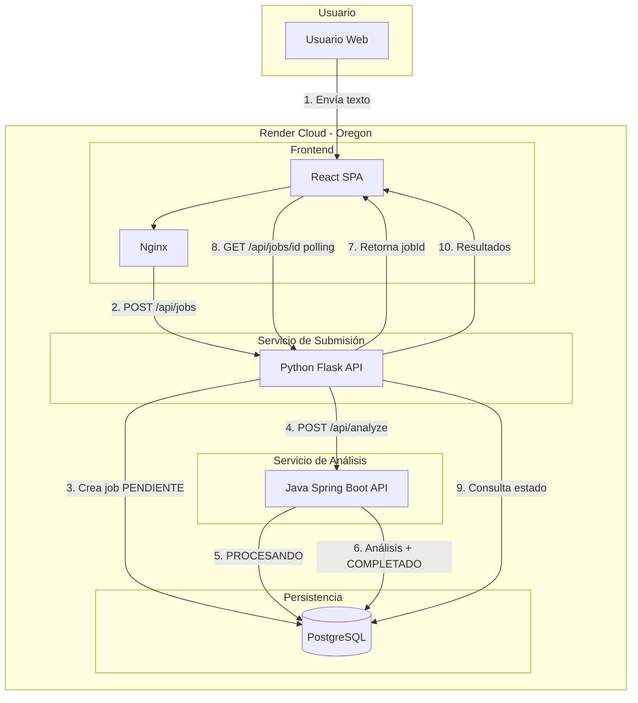

# Diagrama de Componentes - AnalytiCore

## Vista General

## Flujo de Datos

| Paso | Origen | Destino | Acción |
|------|--------|---------|--------|
| 1 | Usuario | Frontend | Introduce texto y envía |
| 2 | Frontend | Python | POST `/api/jobs` con el texto |
| 3 | Python | PostgreSQL | Crea registro con estado `PENDIENTE` |
| 4 | Python | Java | POST `/api/analyze` con `jobId` |
| 5 | Java | PostgreSQL | Actualiza estado a `PROCESANDO` |
| 6 | Java | PostgreSQL | Guarda sentimiento, keywords, `COMPLETADO` |
| 7 | Python | Frontend | Devuelve `jobId` |
| 8 | Frontend | Python | Polling GET `/api/jobs/{jobId}` cada 2s |
| 9-10 | Python | Frontend | Retorna estado y resultados |

## Contenedores Docker

| Componente | Imagen | Puerto |
|------------|--------|--------|
| Frontend | `node:20` + `nginx:alpine` | 80 |
| Python Service | `python:3.11-slim` | 5000 |
| Java Service | `eclipse-temurin:17` | 8080 |
| PostgreSQL | Render Managed | 5432 |

## Patrones Cloud Aplicados

- **Empaquetado Docker**: Cada componente en su propia imagen
- **APIs RESTful**: Comunicación exclusiva vía HTTP/JSON
- **Stateless**: Todo el estado en PostgreSQL
- **Configuración externa**: `DATABASE_URL`, `JAVA_SERVICE_URL` vía variables de entorno
- **Arquitectura limpia**: Capas separadas en cada servicio
